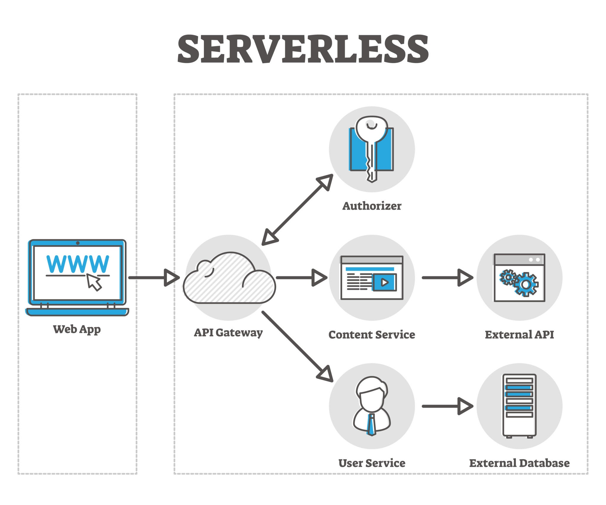

# 🛡️ PassCheck: Secure Authentication System

**PassCheck** is a "Security-First" web application built with Flask. It demonstrates modern defensive programming techniques to mitigate common authentication vulnerabilities such as **Brute-Force attacks**, **Credential Stuffing**, and **High-Performance Password Cracking**.



## 📋 Table of Contents
1. [Key Security Features](#-key-security-features)
2. [Automated Setup (Recommended)](#-automated-setup-recommended)
3. [Manual Setup (Step-by-Step)](#-manual-setup-step-by-step)
4. [Running the Application](#-running-the-application)
5. [Security Audit Notes (VAPT)](#-security-audit-notes-vapt)

---

## ✨ Key Security Features

* **Argon2id Hashing:** Industry-standard password protection.
* **Bot Mitigation:** Image-based CAPTCHA engine.
* **SQL Injection Prevention:** Parameterized queries via SQLAlchemy.
* **Session Security:** Secure session-based state management.

---

## 🚀 Automated Setup (Recommended)


### 1. Clone the Repository
```bash
git clone [https://github.com/your-username/Pass_check.git](https://github.com/your-username/Pass_check.git)
cd Pass_check
 
 ```

## Run the Setup Script
On macOS / Linux:

chmod +x setup.sh && ./setup.sh

On Windows:

setup_windows.bat

##  🛠️ Manual Setup (Step-by-Step)

If you prefer to configure the environment manually, use the following commands based on your Operating System.

Option A: macOS / Linux

# Create a virtual environment using Python 3.13
python3.13 -m venv venv

# Activate the environment
source venv/bin/activate

# Install requirements
pip install --upgrade pip
pip install -r requirements.txt

Option B: Windows

# Create a virtual environment
python -m venv venv

# Activate the environment
venv\Scripts\activate

# Install requirements
python -m pip install --upgrade pip
pip install -r requirements.txt


🚦 Running the Application
Once the setup is complete, ensure your virtual environment is active and run:

# Start the Flask server
python app.py

Access the application at: http://127.0.0.1:5000

Gemini said
Here is the professional README.md content focused strictly on the installation process. It provides clear, copy-pasteable blocks for every setup scenario.

Markdown
# 🛡️ PassCheck: Secure Authentication System

**PassCheck** is a "Security-First" web application built with Flask. It demonstrates modern defensive programming techniques to mitigate common authentication vulnerabilities such as **Brute-Force attacks**, **Credential Stuffing**, and **High-Performance Password Cracking**.


## 📋 Table of Contents
1. [Key Security Features](#-key-security-features)
2. [Automated Setup (Recommended)](#-automated-setup-recommended)
3. [Manual Setup (Step-by-Step)](#-manual-setup-step-by-step)
4. [Running the Application](#-running-the-application)
5. [Security Audit Notes (VAPT)](#-security-audit-notes-vapt)

---

## ✨ Key Security Features

* **Argon2id Hashing:** Industry-standard password protection.
* **Bot Mitigation:** Image-based CAPTCHA engine.
* **SQL Injection Prevention:** Parameterized queries via SQLAlchemy.
* **Session Security:** Secure session-based state management.

---

## 🚀 Automated Setup (Recommended)


### 1. Clone the Repository
```bash
git clone [https://github.com/your-username/Pass_check.git](https://github.com/your-username/Pass_check.git)
cd Pass_check

```

2. Run the Setup Script
On macOS / Linux:

Bash
chmod +x setup.sh && ./setup.sh
On Windows:

Code snippet
setup.bat
🛠️ Manual Setup (Step-by-Step)
If you prefer to configure the environment manually, use the following commands based on your Operating System.

Option A: macOS / Linux
Bash
# Create a virtual environment using Python 3.13
python3.13 -m venv venv

# Activate the environment
source venv/bin/activate

# Install requirements
pip install --upgrade pip
pip install -r requirements.txt
Option B: Windows
Code snippet
# Create a virtual environment
python -m venv venv

# Activate the environment
venv\Scripts\activate

# Install requirements
python -m pip install --upgrade pip
pip install -r requirements.txt


🚦 Running the Application
Once the setup is complete, ensure your virtual environment is active and run:

Bash
# Start the Flask server
python app.py
Access the application at: http://127.0.0.1:5000

🕵️ Security Audit Notes (VAPT Perspective)

A07:2021-Identification and Authentication Failures: Implementing Argon2id prevents offline cracking.

A03:2021-Injection: Parameterized queries via SQLAlchemy ORM neutralize SQLi.

📄 License
This project is open-source and available under the MIT License.


